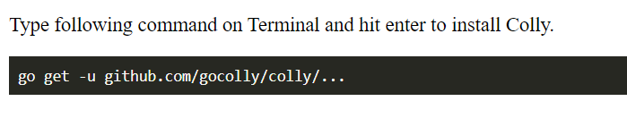
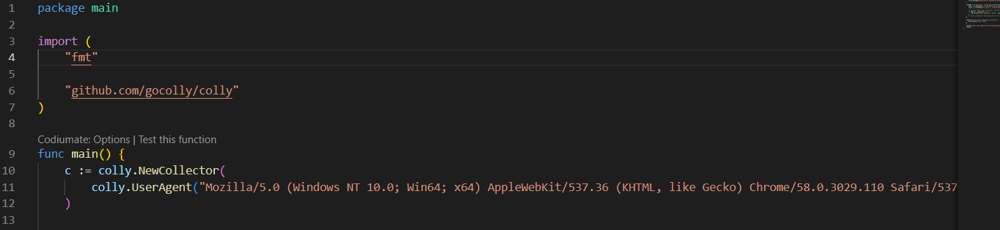
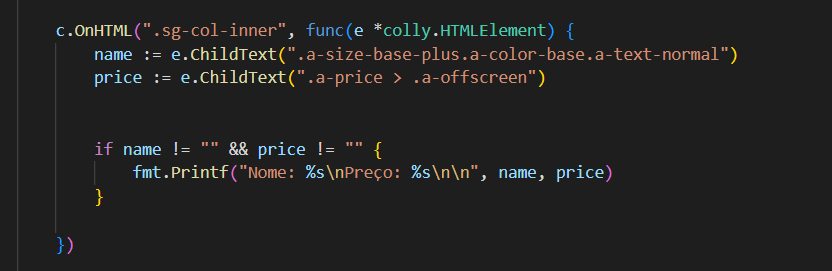
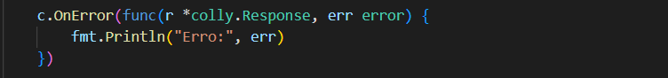
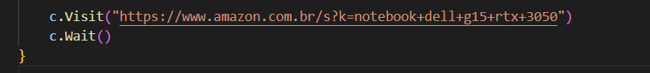
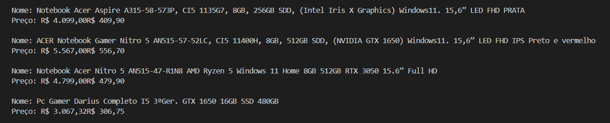

#🚀 Criando Meu Primeiro Web Scraper em Go

Hoje, vou compartilhar com vocês a minha aventura criando um web scraper simples em Go. Estou ainda aprendendo sobre essa linguagem. Nosso objetivo? Extrair informações sobre notebooks Dell G15 da Amazon - queremos seus nomes e preços, já que estou precisando trocar meu notebook é uma boa poder ter uma lista de possíveis compras 🤖💻

🛠 Passo 1: Configurando o Ambiente
Antes de mais nada, precisamos ter Go instalado. A instalação é tranquila - basta seguir as instruções no site oficial do Go. Depois de pronto, estamos a um passo de começar nossa aventura.

🕵️‍♂️ Passo 2: Explorando a Biblioteca Colly
Nossa ferramenta para o scraping será a biblioteca Colly, amigável para novatos como nós. Primeiro, vamos instalá-la:

📝 Passo 3: Escrevendo o Código
Agora, sim, a parte emocionante! Criamos um arquivo chamado main.go e começamos com o básico:

👉 Nota: Usamos um UserAgent para simular um navegador real, ajudando a evitar bloqueios.

🎣 Capturando os Dados

A magia acontece aqui, onde capturamos o nome e o preço dos produtos:

🚨 Lidando com Erros

Vamos tratar erros de forma simples para nosso programa não parar do nada:

🚀 Iniciando o Scraper

E finalmente, dizemos ao nosso scraper para visitar a página desejada:

🚀 Aqui temos o resultado

📚 O Que Aprendi

Seletores Importantes: Precisam ser exatos, mas flexíveis para mudanças na estrutura da página.
Erros: Eles são parte do processo. O tratamento de erros é essencial.
Sempre Há Espaço para Melhorias: Já estou pensando em expandir e otimizar.

🎉 Conclusão
Foi um desafio interessante para prender. 🌟
Experimente com o código, explore novos seletores, e talvez tente fazer o mesmo processo em diferentes sites. Lembre-se de respeitar as políticas dos sites🎈
O código atual ainda irá sofrer alterações para buscar um dos itens específicos da lista(o notebook que for escolhido, inclusive aceito dicas), e depois ele servirá para monitorar os preços e me enviar onde está mais baixo. Ou seja ainda vamos adicionar mais complexidade. 
Obrigado para quem leu até aqui...
